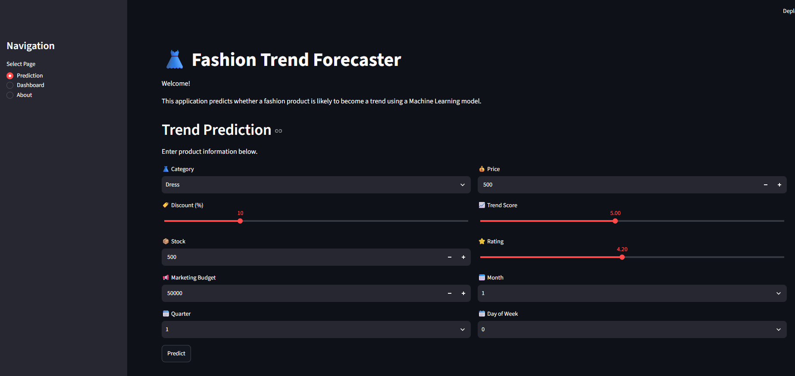
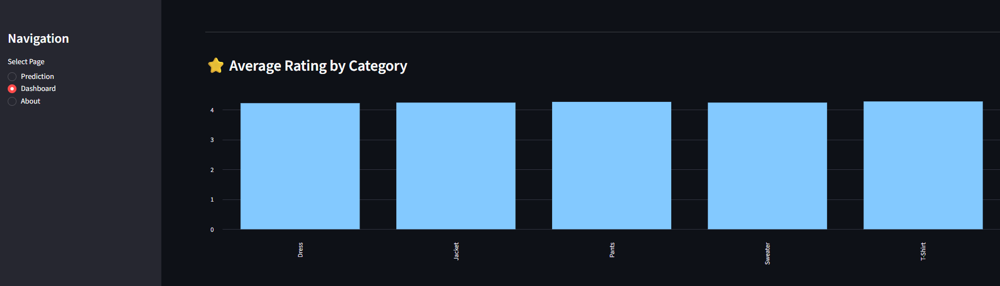
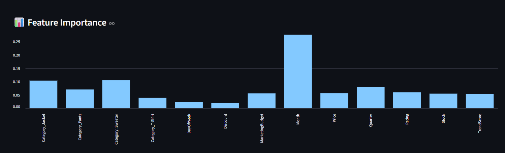

# 👗 Fashion Trend Forecaster

A Machine Learning application that predicts whether a fashion product is likely to become a trend.

## 🎯 Project Overview

Fashion trends are influenced by multiple factors such as sales performance, pricing, discounts, customer ratings, stock levels and marketing activity.

This project uses Machine Learning to analyze these factors and predict the trend potential of fashion products.

The project includes an interactive Streamlit dashboard where users can explore the dataset and generate trend predictions.

## 🤖 Machine Learning

- Algorithm: Random Forest Classifier
- Problem Type: Binary Classification
- Dataset: Synthetic Fashion Dataset
- Feature Importance Analysis

## 📊 Features

The model uses features such as:

- Category
- Sales
- Price
- Discount
- Trend Score
- Stock
- Rating
- Marketing Budget
- Month
- Quarter
- Day of Week

## 🖥️ Dashboard

The application provides:

- 🔮 Fashion trend prediction
- 📊 Sales and stock analysis
- ⭐ Average rating analysis
- 📈 Feature importance visualization
- 📋 Dataset preview

## 🛠️ Technologies

- Python
- Pandas
- NumPy
- Scikit-learn
- Random Forest
- Streamlit
- Matplotlib
- Seaborn
- Joblib
- Jupyter Notebook

## 📁 Project Structure

## 📸 Dashboard Preview

### 🔮 Trend Prediction



### 📊 Fashion Analytics Dashboard


### ⭐ Average Rating



### 📈 Feature Importance



```text
Fashion-Trend-Forecaster/
│
├── app/
│   └── app.py
│
├── data/
│   └── fashion_trend_dataset.csv
│
├── models/
│   ├── features.pkl
│   ├── importance.pkl
│   └── random_forest.pkl
│
├── notebooks/
│   └── Fashion_Trend_Forecaster_Pro.ipynb
│
├── fashion_trend_forecaster.ipynb
├── requirements.txt
├── README.md
└── .gitignore


